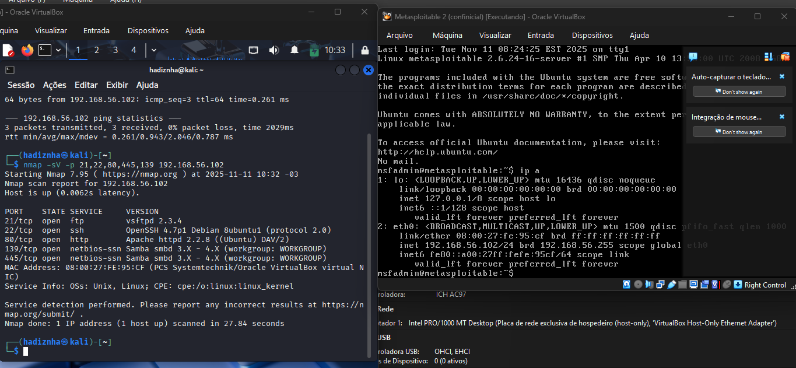
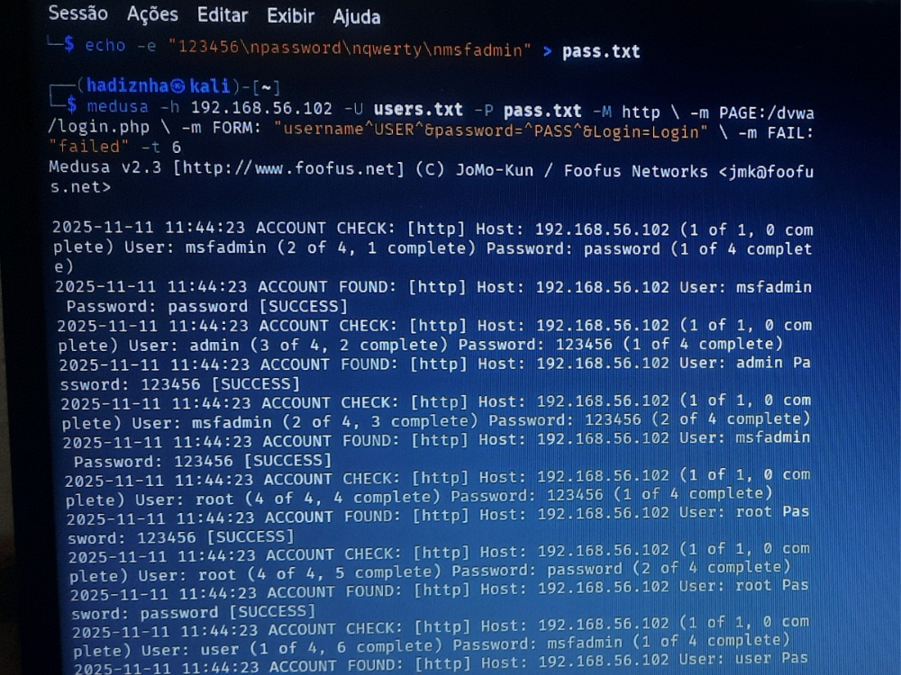
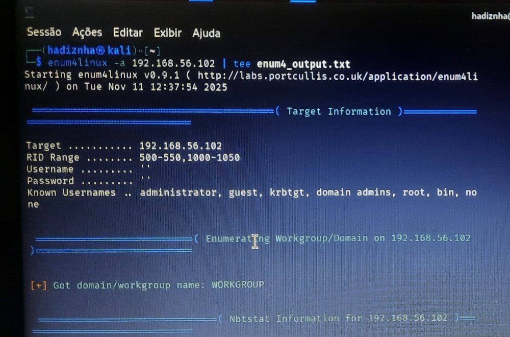
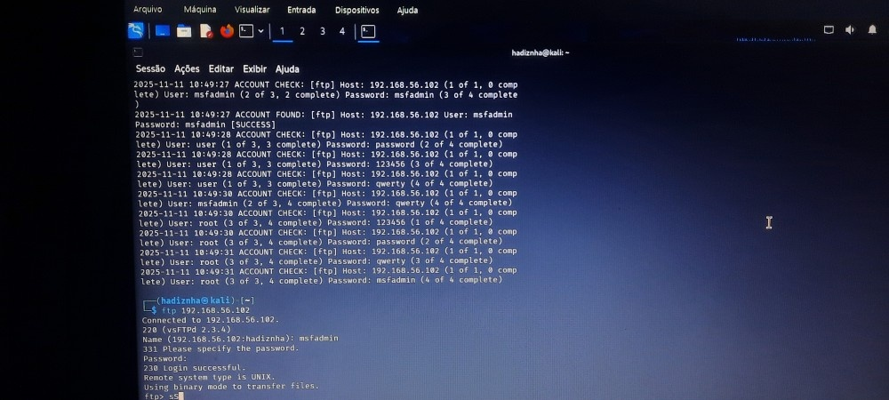

# ✅ Desafio DIO: Simulação de Ataque de Força Bruta (Desafio Concluído!)

Este projeto documenta a montagem, o diagnóstico de falhas de rede, a solução e a conclusão bem-sucedida do desafio de Força Bruta utilizando **Kali Linux** e **Metasploitable 2**.

---

## 1. ⚙️ Diagnóstico e Solução de Conectividade

O desafio inicial foi a falha de comunicação de serviços devido à rede **NAT** (IPs como `10.0.2.15`) que isolava o Metasploitable 2.

### **1.1. O Problema Comprovado (Portas Fechadas)**

* O **Nmap** na rede NAT reportou todas as portas críticas como **closed**, e o FTP foi recusado.
    
* Tentativas de reiniciar serviços no Metasploitable 2 falharam (Comando `service` não encontrado).

### **1.2. A Solução (Host-Only) e Comprovação**

A reconfiguração para **Adaptador Somente de Host (Host-Only)** foi implementada, forçando as VMs a se comunicarem na faixa `192.168.56.x`.

* **Comprovação:** O Nmap confirmou que os serviços **FTP (21), SSH (22), HTTP (80)** estão acessíveis.
    

---

## 2. 🎯 Ataques de Força Bruta com Medusa (Concluídos)

Com a comunicação estabelecida, a ferramenta **Medusa** foi utilizada para comprometer os serviços expostos.

### **2.1. Ataque em FTP (Porta 21) - SUCESSO**

O Medusa encontrou as credenciais do serviço FTP (vsFTPd).

* **Credenciais Encontradas:** `msfadmin:msfadmin`
* **Resultado Comprovado:**
    

### **2.2. Ataque em Formulário Web (DVWA - Porta 80) - SUCESSO**

O Medusa foi executado contra a interface de login do DVWA, encontrando múltiplas credenciais.

* **Alvo:** Login do DVWA (`http://192.168.56.x/dvwa/login.php`).
* **Comando de Ataque (Medusa):**
    ```bash
    medusa -h 192.168.56.102 -U users.txt -P pass.txt -M http \
    -m PAGE:/dvwa/login.php -m FORM:"username=^USER^&password=^PASS^&Login=Login" \
    -m FAIL:"failed" -t 6
    ```
    
* **Resultado:** Credenciais de login do DVWA descobertas, incluindo: `admin:password`, `msfadmin:123456`, e `root:password`.
    

### **2.3. Ataque em SMB (Porta 445) - SUCESSO**

O Medusa foi utilizado para atacar o serviço Samba (SMB), utilizando wordlists personalizadas.

* **Comando de Ataque (Medusa):**
    ```bash
    medusa -h 192.168.56.102 -U smb_users.txt -P senhas_spray.txt -M smbnt -t 2 -T 50
    ```
* **Credenciais Encontradas:** `msfadmin:msfadmin`
* **Resultado Comprovado:**
    

---

## 3. 🛡️ Recomendações de Mitigação

1.  **Limitação de Tentativas (Rate Limiting):** Bloquear IP após poucas tentativas falhas.
2.  **Senhas Fortes:** Forçar o uso de senhas longas e complexas.
3.  **Princípio do Menor Privilégio:** Desativar serviços de rede não utilizados (Ex: vsFTPd, SMB).
