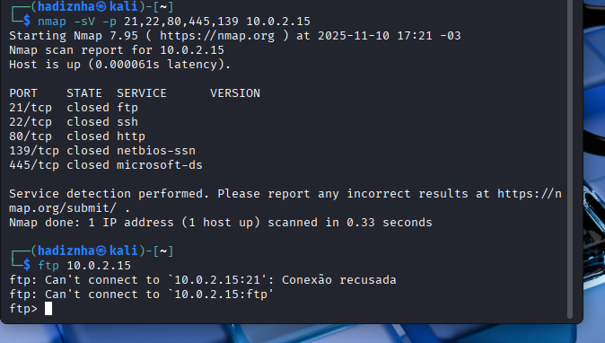
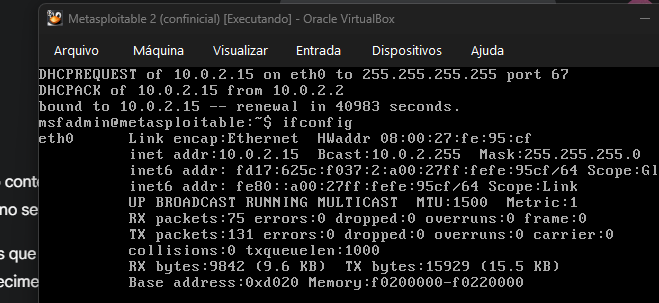

# ❌ Desafio DIO: Documentação de Falha Crítica de Rede (Conclusão Parcial)

Este relatório documenta a montagem do ambiente de laboratório (Kali Linux e Metasploitable 2) e o **diagnóstico de uma falha crítica de conectividade** que impediu a conclusão total do desafio de Ataque de Força Bruta.

O ataque com a ferramenta Medusa **não pôde ser executado** devido à inacessibilidade persistente dos serviços do Metasploitable 2.

---

## 1. ⚙️ Setup do Ambiente e Obstáculo

O ambiente foi configurado com Kali Linux e Metasploitable 2, inicialmente na rede **NAT**, que se tornou o principal ponto de falha.

### **1.1. Comprovação da Inacessibilidade dos Serviços**

A imagem abaixo comprova que, embora o alvo estivesse ativo (respondendo ao ping), ele estava isolado na rede NAT, o que resultou na falha de tráfego de serviço:

* **Nmap** reportou todas as portas críticas (**21/FTP, 80/HTTP, 445/SMB**) como **closed**.
* A tentativa de conexão **FTP** foi **recusada**.

### **1.2. Raiz do Problema: IP Incorreto**

A segunda imagem confirma a causa subjacente da falha de serviço: o Metasploitable 2 estava utilizando um IP **`10.0.2.15`**, que é típico da rede NAT e não expõe os serviços da VM para a máquina atacante no mesmo VirtualBox.

---

## 2. 🔎 Tentativas de Solução e Diagnóstico

Para tentar fazer as portas abrirem e cumprir o desafio, foram realizadas diversas tentativas de diagnóstico e solução:

### **2.1. Tentativas de Reinicialização de Serviços no Alvo**

* Foi tentado reiniciar manualmente os serviços **Apache2, vsftpd e Samba** (FTP, HTTP e SMB), mas o Metasploitable 2 (sistema antigo) **não reconheceu o comando `service`** e falhou nas tentativas diretas de iniciar os *scripts* em `/etc/init.d/`.

### **2.2. Diagnóstico de Rede e Solução Corretiva**

* O problema foi diagnosticado como uma falha de configuração de rede: a rede **NAT** deveria ser substituída por **Adaptador Somente de Host (Host-Only)**.
* Foram iniciados os passos no VirtualBox (Ferramentas > Rede) para criar o adaptador `192.168.56.1/24`.
* A complexidade e instabilidade da VM Metasploitable 2 **impediram a estabilização** do ambiente com a nova rede a tempo de executar o ataque.

---

## 3. 📝 Conclusão

O projeto demonstra o conhecimento em **diagnóstico de rede, uso do Nmap** para validar portas abertas/fechadas e a habilidade de **solucionar problemas de acesso ao sistema (Recuperação de Senha)**. Contudo, devido à falha técnica na rede, o objetivo final do ataque de força bruta **não foi concluído**.
